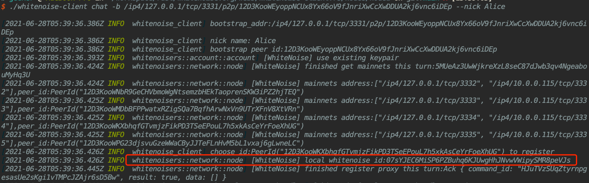
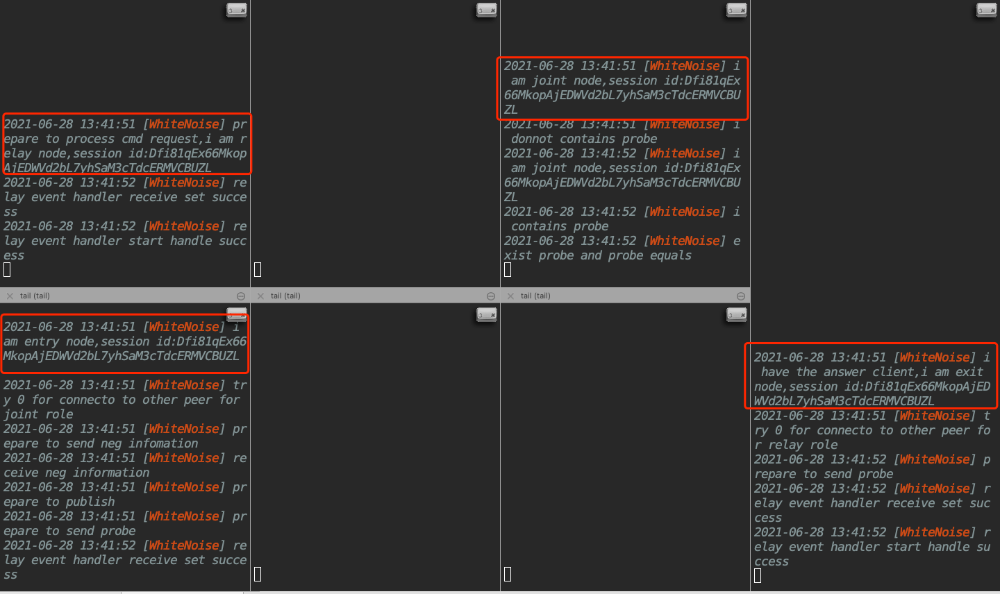
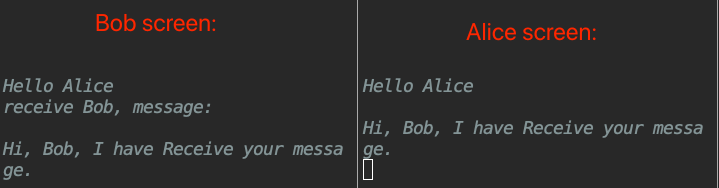
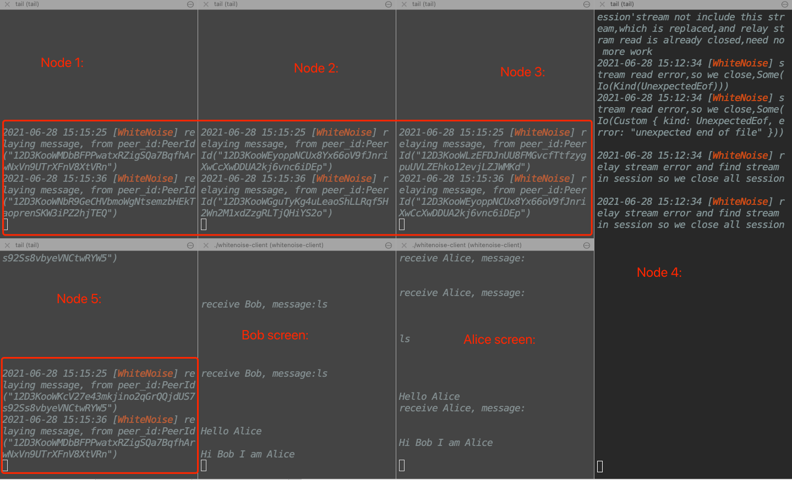

# WhiteNoise For Substrate

A P2P privacy network [WhiteNoise](https://github.com/Evanesco-Labs/WhiteNoise) node template adapted to substrate.

## Getting Started

Follow the steps below to get started with the WhiteNoise network node.

### Rust Setup

First, complete the [basic Rust setup instructions](./docs/rust-setup.md).

### Build

The `cargo build` command will perform an initial build. Use the following command to build the node
without launching it:

```sh
cargo build --release
```

### Embedded Docs

Once the project has been built, the following command can be used to explore all parameters and
subcommands:

```sh
./target/release/node-template -h
```

Specific parameters for WhiteNoise node:

- noise-bootstrap: Set the address of the WhiteNoise Network Bootstrap node. 

- noise-port: Set the local port to listen for WhiteNoise protocols.

Simply ignore these two parameters, if you want to run as an original substrate template node without WhiteNoise service.

## Run
The following shows how to start a WhiteNoise node as a service on a substrate node template. 
The WhiteNoise node will new an account from the same keypair as the substrate node template. 
### Prepare
First, we'd better to build 5 directories, containing boot directory and node1/2/3/4 directory;
### Multi-Node Local Network
These steps show how to start a local WhiteNoise Network and substrate multi-node consensus as the same time, 
refer to this [substrate tutoial](https://substrate.dev/docs/en/tutorials/start-a-private-network/)

First, start a node as a WhiteNoise network Bootstrap(suggest to using nohup command to start):
```sh
cd path/to/boot
nohup ./node-template \
--base-path /tmp/alice \
  --chain local \
  --alice \
  --port 30333 \
  --ws-port 9945 \
  --rpc-port 9933 \
  --node-key 0000000000000000000000000000000000000000000000000000000000000001 \
  --telemetry-url 'wss://telemetry.polkadot.io/submit/ 0' \
  --validator \
--noise-port 3331 &
```

Copy the node address in log, for later use. 
The Bootstrap node address is `/ip4/127.0.0.1/tcp/3331/p2p/12D3KooWEyoppNCUx8Yx66oV9fJnriXwCcXwDDUA2kj6vnc6iDEp`, when log appears like the following:
```verilog
2021-06-08 18:13:55 local Multiaddress: /ip4/127.0.0.1/tcp/3331/p2p/12D3KooWEyoppNCUx8Yx66oV9fJnriXwCcXwDDUA2kj6vnc6iDEp
```


Then, start multiple nodes as WhiteNoise network relay nodes, make sure they use different ports.

Start a relay node:
```sh
cd path/to/node1
nohup ./node-template \
--base-path /tmp/bob \
  --chain local \
  --bob \
  --port 30334 \
  --ws-port 9946 \
  --rpc-port 9934 \
  --telemetry-url 'wss://telemetry.polkadot.io/submit/ 0' \
  --validator \
  --bootnodes /ip4/127.0.0.1/tcp/30333/p2p/12D3KooWEyoppNCUx8Yx66oV9fJnriXwCcXwDDUA2kj6vnc6iDEp \
--noise-port 3332 \
--noise-bootstrap /ip4/127.0.0.1/tcp/3331/p2p/12D3KooWEyoppNCUx8Yx66oV9fJnriXwCcXwDDUA2kj6vnc6iDEp &
```

Start other nodes in the same way ...
```sh
cd path/to/node2
nohup ./node-template \
--base-path /tmp/charlie \
  --chain local \
  --charlie \
  --port 30335 \
  --ws-port 9947 \
  --rpc-port 9935 \
  --telemetry-url 'wss://telemetry.polkadot.io/submit/ 0' \
  --validator \
  --bootnodes /ip4/127.0.0.1/tcp/30333/p2p/12D3KooWEyoppNCUx8Yx66oV9fJnriXwCcXwDDUA2kj6vnc6iDEp \
--noise-port 3333 \
--noise-bootstrap /ip4/127.0.0.1/tcp/3331/p2p/12D3KooWEyoppNCUx8Yx66oV9fJnriXwCcXwDDUA2kj6vnc6iDEp &
```

```sh
cd path/to/node3
nohup ./node-template \
--base-path /tmp/dave \
  --chain local \
  --dave \
  --port 30336 \
  --ws-port 9948 \
  --rpc-port 9936 \
  --telemetry-url 'wss://telemetry.polkadot.io/submit/ 0' \
  --validator \
  --bootnodes /ip4/127.0.0.1/tcp/30333/p2p/12D3KooWEyoppNCUx8Yx66oV9fJnriXwCcXwDDUA2kj6vnc6iDEp \
--noise-port 3334 \
--noise-bootstrap /ip4/127.0.0.1/tcp/3331/p2p/12D3KooWEyoppNCUx8Yx66oV9fJnriXwCcXwDDUA2kj6vnc6iDEp &
```

```sh
cd path/to/node4
nohup ./node-template \
--base-path /tmp/eve \
  --chain local \
  --eve \
  --port 30337 \
  --ws-port 9949 \
  --rpc-port 9937 \
  --telemetry-url 'wss://telemetry.polkadot.io/submit/ 0' \
  --validator \
  --bootnodes /ip4/127.0.0.1/tcp/30333/p2p/12D3KooWEyoppNCUx8Yx66oV9fJnriXwCcXwDDUA2kj6vnc6iDEp \
--noise-port 3335 \
--noise-bootstrap /ip4/127.0.0.1/tcp/3331/p2p/12D3KooWEyoppNCUx8Yx66oV9fJnriXwCcXwDDUA2kj6vnc6iDEp &
```

```sh
./node-template \
--base-path /tmp/dave \
  --chain local \
  --dave \
  --port 30336 \
  --ws-port 9948 \
  --rpc-port 9936 \
  --telemetry-url 'wss://telemetry.polkadot.io/submit/ 0' \
  --validator \
  --bootnodes /ip4/127.0.0.1/tcp/30333/p2p/12D3KooWEyoppNCUx8Yx66oV9fJnriXwCcXwDDUA2kj6vnc6iDEp \
--noise-port 3333 \
--noise-bootstrap /ip4/127.0.0.1/tcp/3331/p2p/12D3KooWEyoppNCUx8Yx66oV9fJnriXwCcXwDDUA2kj6vnc6iDEp
```

```sh
./node-template \
--base-path /tmp/ellin \
  --chain local \
  --ellin \
  --port 30337 \
  --ws-port 9949 \
  --rpc-port 9937 \
  --telemetry-url 'wss://telemetry.polkadot.io/submit/ 0' \
  --validator \
  --bootnodes /ip4/127.0.0.1/tcp/30333/p2p/12D3KooWEyoppNCUx8Yx66oV9fJnriXwCcXwDDUA2kj6vnc6iDEp \
--noise-port 3333 \
--noise-bootstrap /ip4/127.0.0.1/tcp/3331/p2p/12D3KooWEyoppNCUx8Yx66oV9fJnriXwCcXwDDUA2kj6vnc6iDEp
```

## Test Example
The WhiteNoise Network built with substrate-node-template can provide WhiteNoise privacy network services. 
[WhiteNoise Clients](https://github.com/Evanesco-Labs/WhiteNoise-client.rs) are able to access this network and build private and secure connection through this network.


The process of a chat example in local WhiteNoise network is as follows:

### Start WhiteNoise Network
First follow the instructions above to start a Bootstrap node and at least 4 relay nodes.
Copy the Bootstrap node address for later use. 
In this instruction, the address is `/ip4/127.0.0.1/tcp/3331/p2p/12D3KooWEyoppNCUx8Yx66oV9fJnriXwCcXwDDUA2kj6vnc6iDEp`.

### Build Clients
Clone the source code of WhiteNoise Client and enter the directory.

```shell
git clone https://github.com/Evanesco-Labs/WhiteNoise-client.rs.git
cd WhiteNoise-client.rs
```

Follow the [instruction](https://github.com/Evanesco-Labs/WhiteNoise-client.rs#build) to build the WhiteNoise Clients from source.
Make two new directories and copy the compiled client `./target/release/whitenoise-client` into these two directories.
In this instruction we name these two directories `client-Alice` and `client-Bob`.

### Start One Client 
Enter the `client-Alice` directory.
Start an chat **Answer** waiting for others to dial with this command, add your nick name in the `--nick` flag:

```shell
./whitenoise-client chat -b /ip4/127.0.0.1/tcp/3331/p2p/12D3KooWEyoppNCUx8Yx66oV9fJnriXwCcXwDDUA2kj6vnc6iDEp --nick Alice
```

Your unique **WhiteNoiseID** is shown in log, this is your "number" for calls. **WhiteNoiseID** keeps the same, if you start chat example in the same directory and using the same key type.

The following shows the WhiteNoiseID in log, please **REMEMBER IT**, we will use it in the chatting connection built:
```verilog
2021-06-28T05:39:36.426Z INFO  whitenoisers::network::node] [WhiteNoise] local whitenoise id:07sYJEC6MiSP6PZBuhq6KJUwgHhJNvwVWipySMR8peVJs
```


### Start Another Client and Chat
Enter the `client-Bob` directory.
Start a chat **Caller** and dial the **Answer** with this command, fill in the `-n` flag with *Answer*'s *WhiteNoiseID*:

```shell
./whitenoise-client chat -b /ip4/127.0.0.1/tcp/3331/p2p/12D3KooWEyoppNCUx8Yx66oV9fJnriXwCcXwDDUA2kj6vnc6iDEp --nick Bob -n  07sYJEC6MiSP6PZBuhq6KJUwgHhJNvwVWipySMR8peVJs
```

By then, using the command *tail -f nohup.out | grep WhiteNoise* in each whitenoise node console, we will see the circuit building log in the whitenoise node as following:



After seeing "Build circuit success!" in log, both chat clients are able to type and chat on the command line!


At the same time, we will see some transfered log are printed in the hop node(node1 node2 node3 node5):


## Join WhiteNoise Network
In addition to building a complete WhiteNoise network by yourself, substrate-node-template can also join the public WhiteNoise network and as a relay node to provide connection services.
Public here means that the address of their Bootstrap node is public.

The process is as follows:

Get official testnet bootstrap node [Address](./.testnet-boot.md). 
For example `/ip4/118.190.124.88/tcp/3331/p2p/12D3KooWEyoppNCUx8Yx66oV9fJnriXwCcXwDDUA2kj6vnc6iDEp`.

Start a relay node to join this remote testnet:
```sh
./node-template --noise-bootstrap /ip4/118.190.124.88/tcp/3331/p2p/12D3KooWEyoppNCUx8Yx66oV9fJnriXwCcXwDDUA2kj6vnc6iDEp --noise-port 3332 
```
## RPC
The WhiteNoise node service share the original RPC service with substrate node template.
Set the substrate node template RPC port 9933. As an example the following command will gets WhiteNoise network node libp2p PeerIDs through RPC.
```shell
curl -X POST -H "Content-Type: application/json" -d '{"jsonrpc": "2.0", "method": "get_main_nets", "id":1,"params":[10] }' 127.0.0.1:9933
```

## Substrate Node Template

This WhiteNoise node implementation is based on Substrate Node Template. Commands and parameters of the Substrate Node Template still remains. 
WhiteNoise service will not interfere with the original functions. 

Ignore these two parameters (noise-bootstrap, noise-port) to start the original Substrate Node Template.

Learn more about [Substrate Node Template](https://github.com/substrate-developer-hub/substrate-node-template).
